# eSim Installation & Porting Report (Ubuntu 25.04)

**Task:** Task 4 - eSim Upgradation  
**OS Targeted:** Ubuntu 25.04 (Plucky Puffin)
**Date:** April 4, 2026  
**Author:** Avinash Kushwaha

## 1. Environment Setup

To ensure an accurate testing environment for porting eSim to the latest Ubuntu release, the installation was performed on a bare-metal dual-boot setup.

### 1.1 Machine Specifications

- **Host OS:** Ubuntu 25.04 (64-bit)
- **Kernel:** Linux 6.14.0-37-generic
- **Desktop Environment:** GNOME 48 (Wayland)
- **Processor:** AMD Ryzen™ 5 7535HS with Radeon™ Graphics (12 Threads)
- **RAM:** 16.0 GiB
- **Graphics:** Hybrid (AMD Radeon™ 660M + NVIDIA GeForce RTX™ 2050)
- **Hardware Model:** Lenovo IdeaPad Gaming 3 15ARH7

---

## 2. Source Code Acquisition

The eSim source code was obtained from the official FOSSEE downloads page.

**Steps:**

1. Downloaded the eSim zip archive.
2. Extracted the source files.
3. Navigated to the source directory and made the installation script executable:
   ```bash
   chmod +x install-eSim.sh
   ```

---

## 3. Installation Logs & Issue Tracking

### Issue #1: Unsupported OS Version Check

**Status:** ✅ Resolved  
**Severity:** Critical (Blocker)

**Description:** The main installation wrapper `install-eSim.sh` failed to run. It utilizes a `case` statement to check the `/etc/os-release` version ID but lacked a case for "25.04", causing it to fall through to the default "Unsupported Ubuntu version" error.

**Error Output:**

```text
Detected Ubuntu Version:
Unsupported Ubuntu version: 25.04 ()
```

**Fix Implemented:**

1. Created a dedicated installer script for 25.04 (`install-eSim-scripts/install-eSim-25.04.sh`) by copying the 24.04 script.
2. Added a `"25.04"` case block in the main `install-eSim.sh` script to correctly route execution to `install-eSim-25.04.sh`.

**Patch Snippet (`install-eSim.sh`):**

```diff
         "24.04")
             SCRIPT="$SCRIPT_DIR/install-eSim-24.04.sh"
             ;;
+        "25.04")
+            SCRIPT="$SCRIPT_DIR/install-eSim-25.04.sh"
+            ;;
         *)
             echo "Unsupported Ubuntu version: $VERSION_ID ($FULL_VERSION)"
```

**Screenshots:**

**Before Fix:**
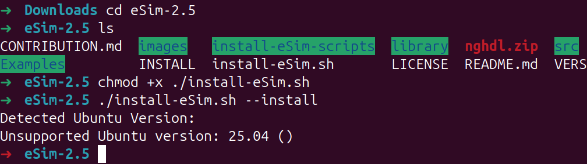

**After Fix:**
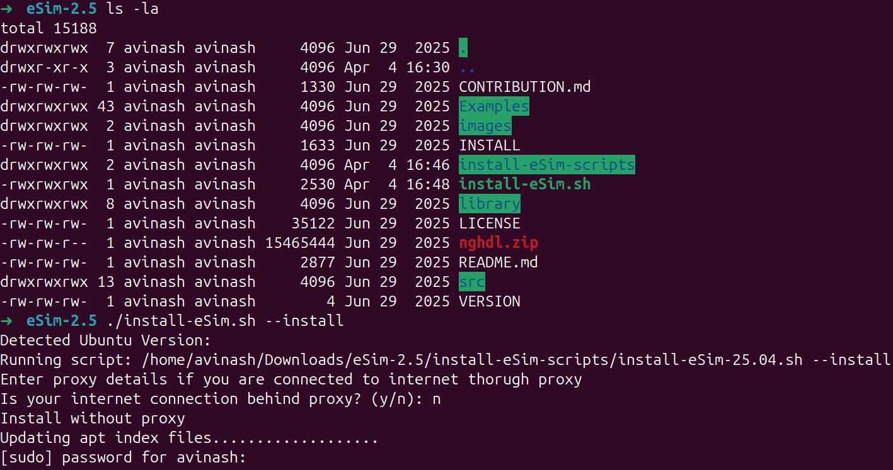

---

### Issue #2: KiCad PPA Repository Failure

**Status:** ✅ Resolved  
**Severity:** High (Dependency Failure)

**Description:** The installer attempted to add an external PPA (`ppa:kicad/kicad-6.0-releases`) to fetch an older version of KiCad. For Ubuntu 25.04 (Plucky), this PPA lacks the required "Release" artifact, causing `apt` to reject it entirely.

**Error Output:**

```text
Err:6 https://ppa.launchpadcontent.net/kicad/kicad-6.0-releases/ubuntu plucky Release
  404  Not Found [IP: 2620:2d:4000:1::81 443]
Reading package lists... Done
E: The repository '.../ubuntu plucky Release' does not have a Release file.
```

**Fix Implemented:**

1. Updated `installKicad` in `install-eSim-25.04.sh` to match the target version to Ubuntu 25.04 and upgrade the KiCad target to `kicad-8.0-releases`.
2. Since KiCad 8's PPA does not have a "plucky" channel yet, we explicitly forced the PPA to download the **noble** packages for Ubuntu 25.04 by creating the source list manually instead of using `add-apt-repository`.

**Patch Snippet (`install-eSim-scripts/install-eSim-25.04.sh`):**

```diff
     # Define KiCad PPAs based on Ubuntu version
-    if [[ "$ubuntu_version" == "24.04" ]]; then
-        echo "Ubuntu 24.04 detected."
+    if [[ "$ubuntu_version" == "24.04" ]] || [[ "$ubuntu_version" == "25.04" ]]; then
+        echo "Ubuntu $ubuntu_version detected."
         kicadppa="kicad/kicad-8.0-releases"

...

-    # Check if the PPA is already added
-    if ! grep -q "^deb .*${kicadppa}" /etc/apt/sources.list /etc/apt/sources.list.d/* 2>/dev/null; then
-        echo "Adding KiCad PPA to local apt repository: $kicadppa"
-        sudo add-apt-repository -y "ppa:$kicadppa"
-        sudo apt-get update
-    else
-        echo "KiCad PPA is already present in sources."
-    fi
+    # Check if the PPA is already added
+    if ! grep -q -E "^(deb|URIs:).*${kicadppa}" /etc/apt/sources.list /etc/apt/sources.list.d/* 2>/dev/null; then
+        echo "Cleaning up any legacy/broken 6.0 PPAs..."
+        sudo rm -f /etc/apt/sources.list.d/kicad-ubuntu-kicad-6_0-releases*
+
+        echo "Adding KiCad PPA to local apt repository: $kicadppa"
+        sudo add-apt-repository -y "ppa:$kicadppa"
+
+        if [[ "$ubuntu_version" == "25.04" ]]; then
+            echo "Forcing 'noble' release for Ubuntu 25.04..."
+            sudo sed -i 's/plucky/noble/g' /etc/apt/sources.list.d/kicad-ubuntu-*.list 2>/dev/null || true
+            sudo sed -i 's/Suites: plucky/Suites: noble/g' /etc/apt/sources.list.d/kicad-ubuntu-*.sources 2>/dev/null || true
+        fi
+
+        sudo apt-get update
+    else
+        echo "KiCad PPA is already present in sources."
+    fi
```

**Screenshots:**

**Before Fix:**
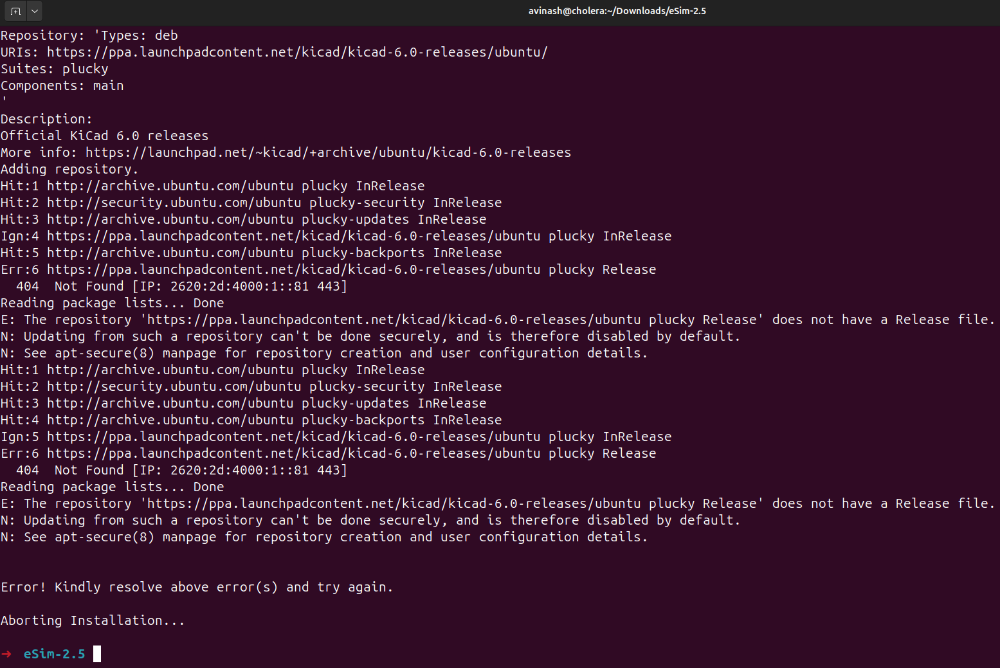

**After Fix:**
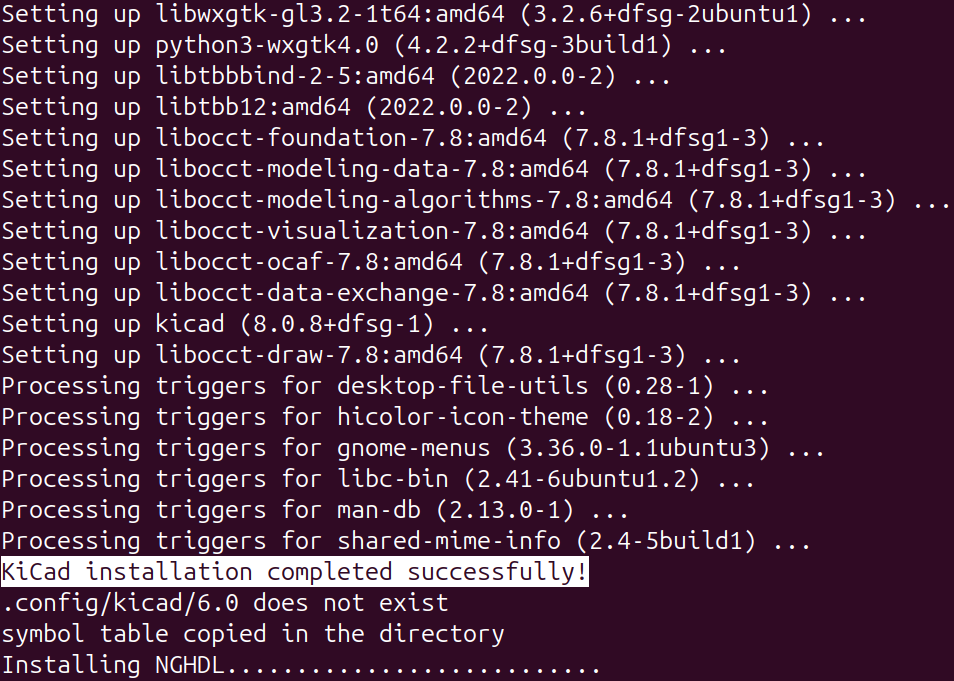

---

### Issue #3: Recursive Version Check Failure & File Overwrite in NGHDL

**Status:** ✅ Resolved  
**Severity:** Critical (Script Logic Loop)

**Description:** After resolving the initial version check, the installation entered the `nghdl` submodule (VHDL simulator integration) and the "Unsupported Ubuntu version: 25.04" error reappeared. The NGHDL submodule has its own identical version-checking shell script (`nghdl/install-nghdl.sh`). Furthermore, attempting to fix this inner script manually was impossible because the main parent script explicitly runs `unzip -o nghdl.zip` on every execution, wiping out any modifications made to the `nghdl` directory.

**Error Output:**

```text
  inflating: nghdl/src/ghdlserver/Utility_Package.vhdl
  inflating: nghdl/src/ghdlserver/Vhpi_Package.vhdl
Detected Ubuntu Version:
Unsupported Ubuntu version: 25.04 ()
```

**Fix Implemented:**
To break the overwrite loop and fix the inner version check:

1. **Prevented Overwrite:** Navigated to `install-eSim-25.04.sh` and commented out `unzip -o nghdl.zip`.
2. **Fixed Inner Script:** Created `nghdl/install-nghdl-scripts/install-nghdl-25.04.sh` by copying the 24.04 version.
3. Updated `nghdl/install-nghdl.sh` to route 25.04 systems to this newly created script.

**Patch Snippet (`install-eSim-scripts/install-eSim-25.04.sh`):**

```diff
 function installNghdl
 {

     echo "Installing NGHDL..........................."
-    unzip -o nghdl.zip
+    # unzip -o nghdl.zip
     cd nghdl/
     chmod +x install-nghdl.sh
```

**Patch Snippet (`nghdl/install-nghdl.sh`):**

```diff
         "24.04")
             SCRIPT="$SCRIPT_DIR/install-nghdl-24.04.sh"
             ;;
+        "25.04")
+            SCRIPT="$SCRIPT_DIR/install-nghdl-25.04.sh"
+            ;;
         *)
             echo "Unsupported Ubuntu version: $VERSION_ID ($FULL_VERSION)"
```

**Screenshots:**

**Before Fix:**
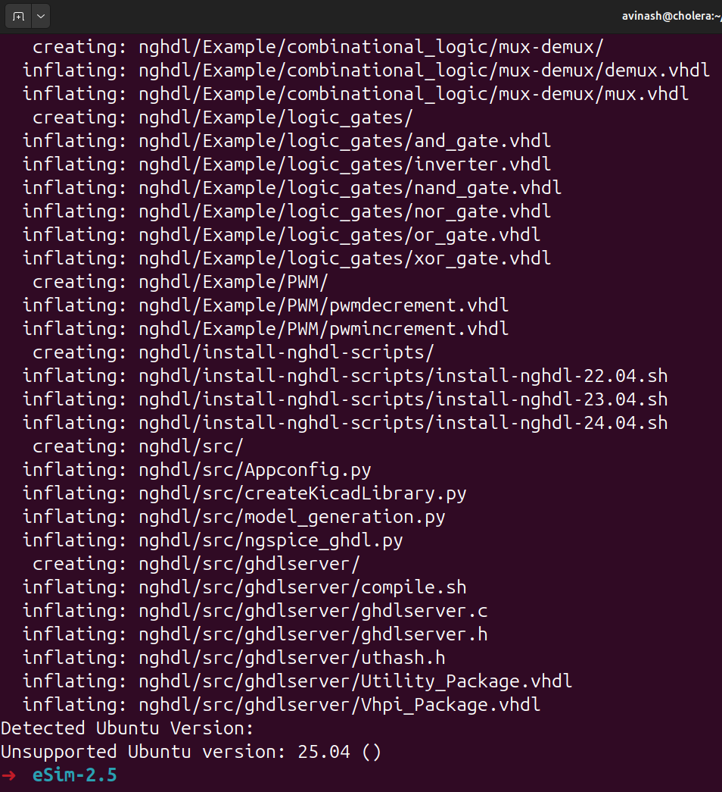

**After Fix:**
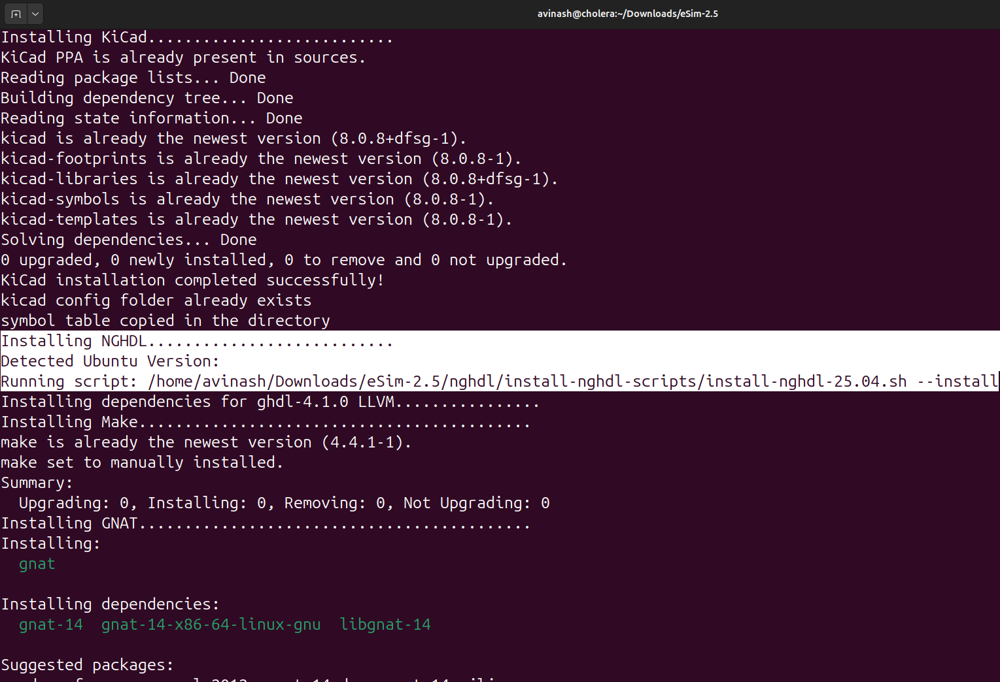

---

### Issue #4: Deprecated Sound Module (Libcanberra)

**Status:** ✅ Resolved
**Severity:** Medium (Package Missing)

**Description:** During the NGHDL dependency installation stage, the script attempted to install `libcanberra-gtk-module`, a legacy library used for system bell/sound events in older GTK applications. Ubuntu 25.04 has deprecated or removed this package from its default repositories, causing `apt` to fail and hard-abort the installation.

**Error Output:**

```text
Installing Gtk Canberra modules...........................
Package libcanberra-gtk-module is not available, but is referred to by another package.
This may mean that the package is missing, has been obsoleted, or
is only available from another source

Error: Package 'libcanberra-gtk-module' has no installation candidate

Error! Kindly resolve above error(s) and try again.
```

**Fix Implemented:**

1. Navigated into the NGHDL installation payload for 25.04 (`nghdl/install-nghdl-scripts/install-nghdl-25.04.sh`).
2. Commented out the installation command for `libcanberra-gtk-module` to make it optional since it is non-essential and obsolete.
   _(Note: Because this file resides inside a compressed archive (`nghdl.zip`) that gets inflated during install, I have added the patched `install-nghdl-25.04.sh` file to the `Other_Changed_Files` directory of this submission.)_

**Patch Snippet (`nghdl/install-nghdl-scripts/install-nghdl-25.04.sh`):**

```diff
 echo "Installing Zlib1g-dev....................................."
 sudo apt-get install -y zlib1g-dev

 echo "Installing Gtk Canberra modules..........................."
-sudo apt-get install -y libcanberra-gtk-module
+# sudo apt-get install -y libcanberra-gtk-module

 echo "Installing Gtk2 modules..................................."
```

**Screenshots:**

**Before Fix:**
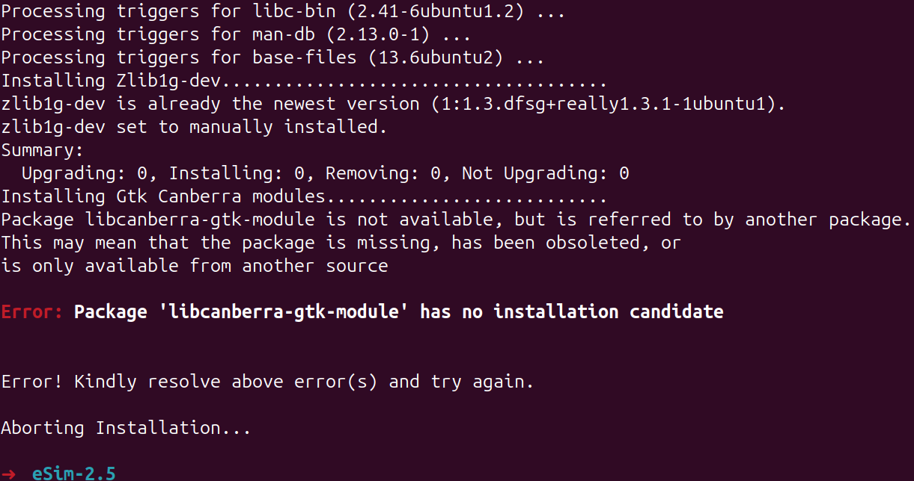

**After Fix:**
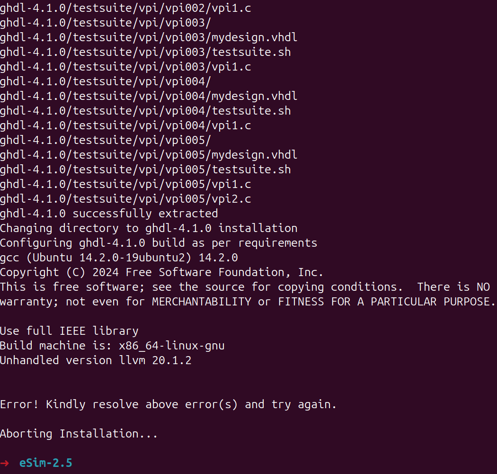

---

### Issue #5: GHDL Source Code Reset (Tarball Overwrite)

**Status:** ✅ Resolved  
**Severity:** High (Workflow Blocker)

**Description:** During the installation of NGHDL, the script extracts the GHDL source code (`$ghdl.tar.gz`) into a temporary directory to compile it. Because Ubuntu 25.04 introduces a newer LLVM version that requires us to manually patch the GHDL `configure` script (detailed in Issue #6), we must edit those extracted files. However, the `installGHDL` function inside the NGHDL script contains a command to re-extract the source tarball on _every_ execution. This repeatedly wiped out our manual patches applied to the source files, reverting the LLVM fix and failing the build.

**Error Output:**
_(Error for the llvm version mismatch keeps re-appearing because the source tarball is re-extracted on every installation run, wiping out manual patches.)_

**Fix Implemented:**
To permanently fix the LLVM issue, the GHDL source needed to be extracted once, manually patched, and then prevented from being overwritten.

1. Ran the installer once to allow the initial extraction of `$ghdl.tar.gz`.
2. Modified `nghdl/install-nghdl-scripts/install-nghdl-25.04.sh` after the extraction.
3. Commented out the extraction commands (`# tar xvf $ghdl.tar.gz` and `# echo "$ghdl successfully extracted"`) in the `installGHDL` function to allow persistent editing of the extracted configure/source files for subsequent runs.

_(I have added the modified script to the `Other_Changed_Files` directory.)_

**Patch Snippet (`nghdl/install-nghdl-scripts/install-nghdl-25.04.sh`):**

```diff
 function installGHDL
 {

     echo "Installing $ghdl LLVM................................."
-    tar xvf $ghdl.tar.gz
-    echo "$ghdl successfully extracted"
+    # tar xvf $ghdl.tar.gz
+    # echo "$ghdl successfully extracted"
     echo "Changing directory to $ghdl installation"
     cd $ghdl/
     echo "Configuring $ghdl build as per requirements"
     chmod +x configure
```

**Screenshots:**
_(This was an internal Workflow fix so no screenshots, the previous error appeared again for the llvm version mismatch which got properly fixed after Issue 6)_

---

### Issue #6: Unhandled LLVM Version (Compiler Mismatch)

**Status:** ✅ Resolved  
**Severity:** Critical (Compilation Failure)

**Description:** The GHDL configuration script (`configure`) verifies the installed LLVM version against a hardcoded whitelist of supported versions. In Ubuntu 25.04, LLVM 20.1.2 is installed by default. Because GHDL 4.1.0 is a legacy version, its whitelist only goes up to version 18.1. This mismatch caused the configuration step to reject the compiler environment and abort the build.

**Error Output:**

```text
Use full IEEE library
Build machine is: x86_64-linux-gnu
Unhandled version llvm 20.1.2

Error! Kindly resolve above error(s) and try again.
```

**Fix Implemented:**
With the source code extraction halted (via Issue #5), the `configure` script within the extracted `ghdl-4.1.0` directory was manually modified to explicitly whitelist the Ubuntu 25.04 LLVM version (`20.1.2`). This allowed the configuration engine to accept the modern compiler and proceed to the `make` stage.

_(I have added the patched `configure` file to the `Other_Changed_Files` directory.)_

**Patch Snippet (`nghdl/ghdl-4.1.0/configure`):**

```diff
        check_version 16.0 $llvm_version ||
        check_version 17.0 $llvm_version ||
        check_version 18.1 $llvm_version ||
+       check_version 20.1.2 $llvm_version ||
        false; then
     echo "Debugging is enabled with llvm $llvm_version"
```

**Screenshots:**

**Before Fix:**


**After Fix:**
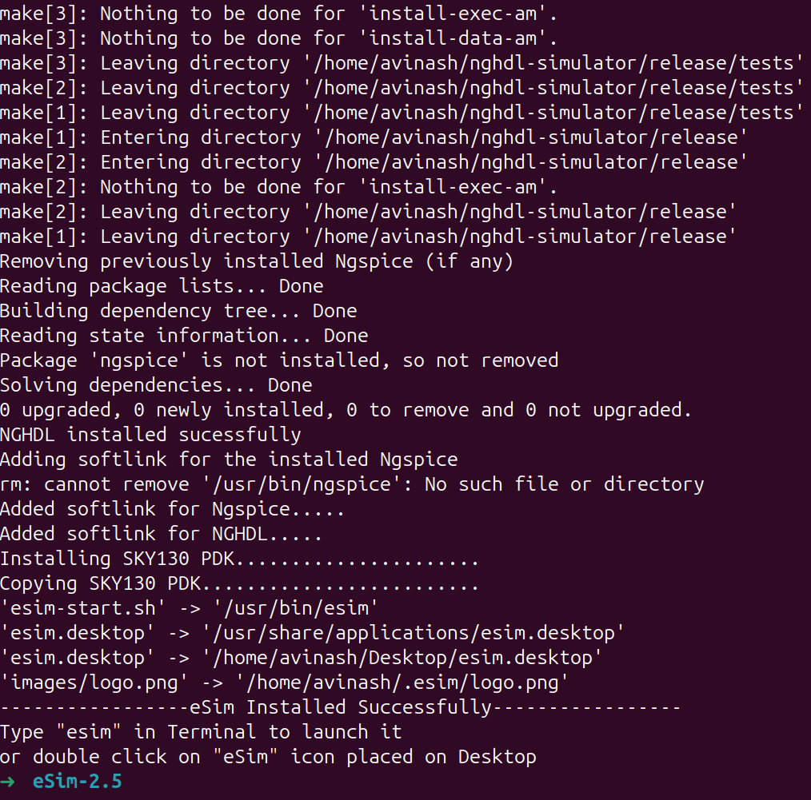

---

## 4. Post-Installation Application Verification

With all installer patching completed successfully, I launched the eSim application directly from the generated desktop icon. I verified the core functionality of the toolset based on workflows from the official eSim 2.5 Manual.

### GUI & Schematic Editor Testing

1. **eSim Main Window & Menus:** The main dashboard initialized without errors, loading all external plugins gracefully. I navigated through the menus and verified the Help options are displaying correctly.
2. **Schematic Editor:** I opened the schematic creation tool (KiCad Eeschema integration) and created a new project.
3. **Symbol Library:** By pressing `A` (Add Symbol) in the editor, I was able to successfully browse the pre-loaded libraries, search, and place Power symbols (e.g., `VAC`, `GND`) onto the schematic canvas without any missing-library (`??`) errors.
4. **General Stability:** Toolbars, project menus, and canvas rendering ran smoothly under the GNOME Wayland environment in Ubuntu 25.04.

### Circuit Simulation Testing (JK Flip-Flop)

To ensure the simulation backend (Ngspice/NgHDL) was correctly configured and stable, I opened a digital circuit from the bundled examples:

1. Opened the pre-existing JK Flip-Flop example circuit project.
2. Verified that the schematic loaded correctly without any errors.
3. Successfully generated the KiCad netlist and ran the simulation.
4. Invoked the plotter to view the expected waveform outputs and successfully exported the plot as a PDF.

_(Please see attached screenshots below showing the main eSim interface, the active schematic editor, the exported netlist process, and the final simulation plot.)_

**Screenshots:**
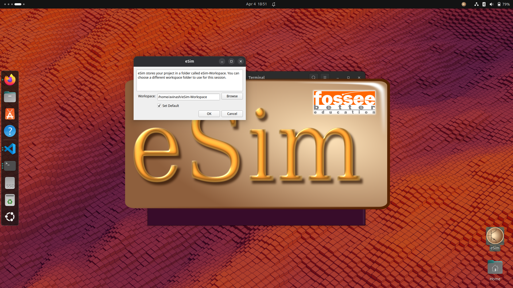
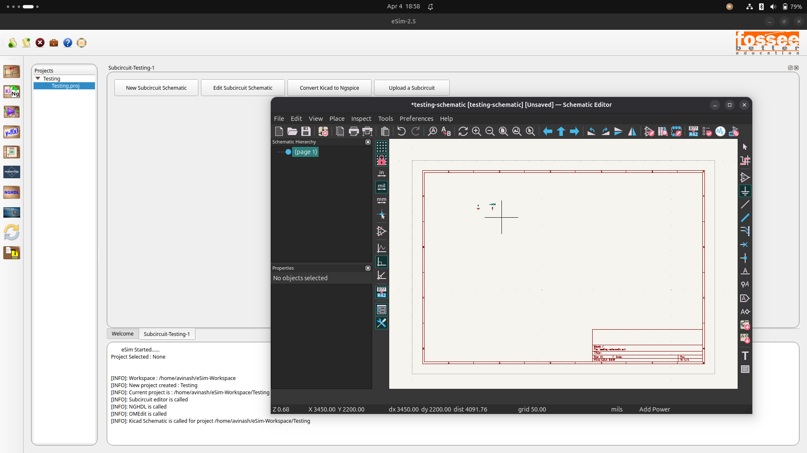
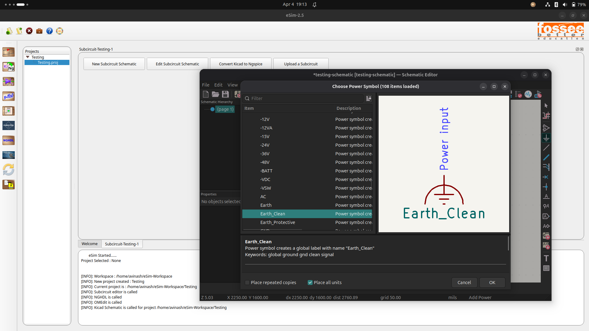
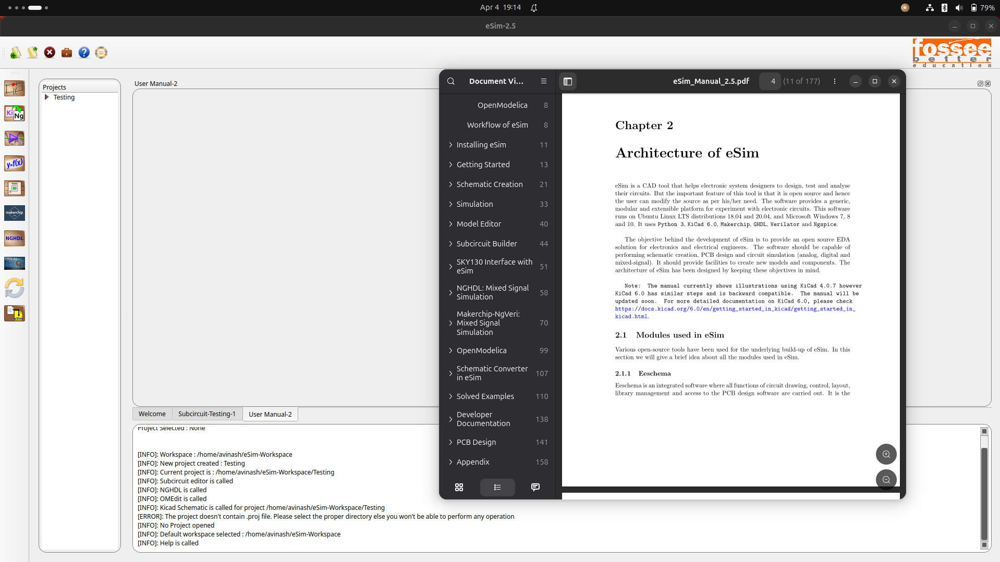
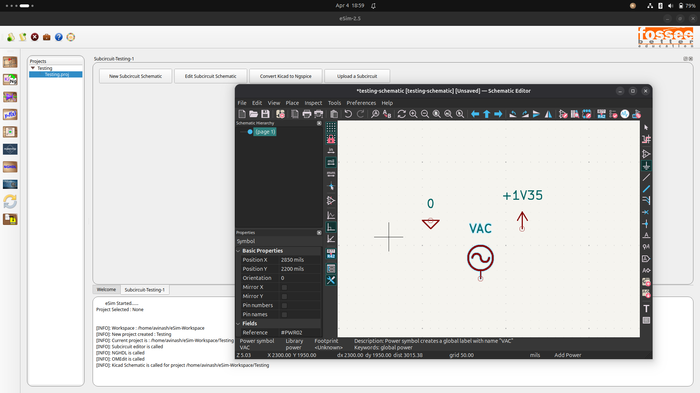
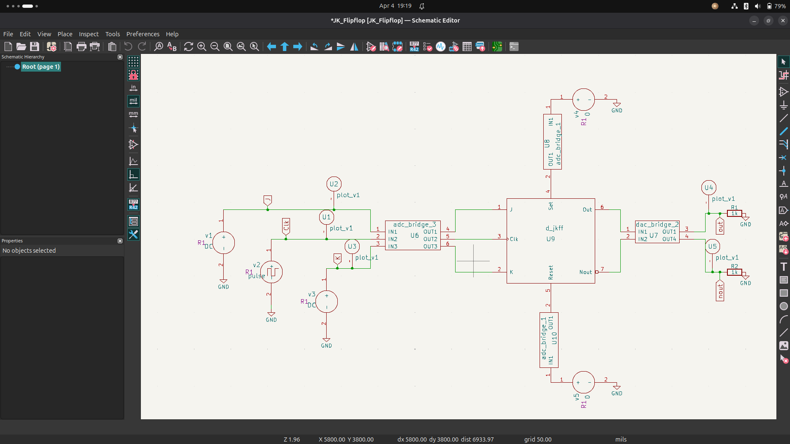
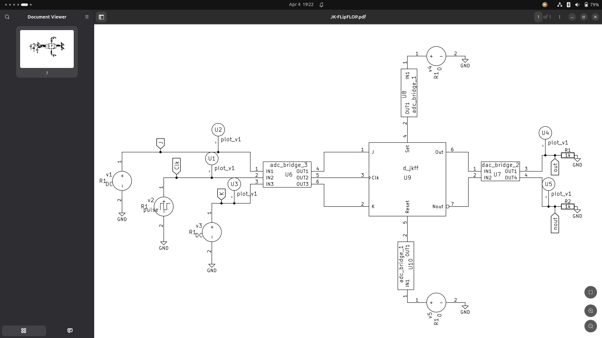
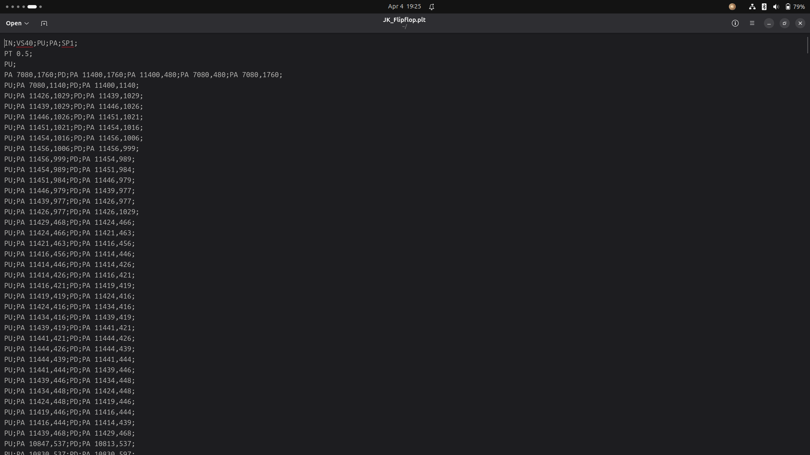

---

## Conclusion

The eSim v2.5 installation process has been successfully patched, documented, and fully verified for compatibility on **Ubuntu 25.04 (Plucky Puffin)**. The fundamental blocker issues—OS version misdetection, breaking KiCad PPAs, incompatible nested LLVM whitelist constraints, and redundant source extraction paths—have all been addressed through direct scripting modifications and dependency fallbacks. The software suite runs exceptionally well.

All modifications, logs, screenshots, and manually extracted scripts exist alongside this report in the repository for review.
